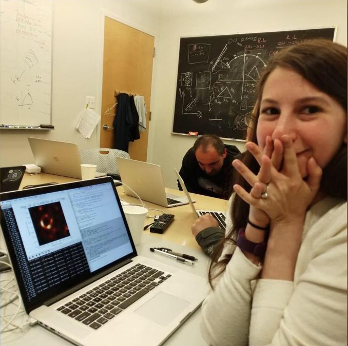
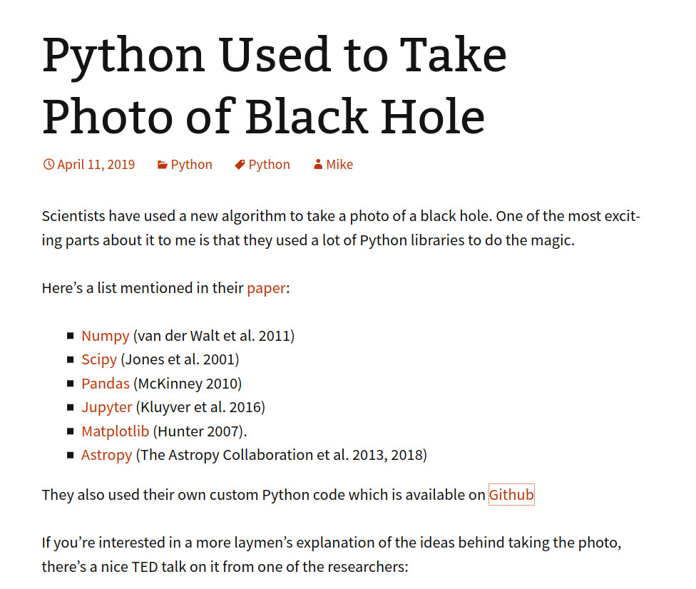

<!-- .slide: class="slide-title" -->

# Introducción a Python para Científicxs

## [Santiago Soler](https://santisoler.github.io)

*San Juan, Argentina | Junio 2020*

---

# ¿Cuándo?

## Martes y Jueves del 23/06 al 2/07

### de 16 a 18hs

---

# ¿Dónde?

## [YouTube Live](https://youtube.com/santis19)

---

# Comentarios habilitados

---

# ¿Quién soy?

* Licenciado en Física (UNR)
* Estudiante de Doctorado en Geofísica (UNSJ)
* Becario Doctoral de CONICET
* Desarrollador de [Fatiando a Terra](https://www.fatiando.org)
* Miembro de [Computer-Oriented Geoscience Lab](https://www.compgeolab.org)

---

# ¿Quiénes son ustedes?

## Google Forms:

### https://forms.gle/7v74guYzZpyUaw3E7

---

# Objetivos

* Introducirnos en la sintaxis de Python
* Jupyter Notebooks
* Utilizar librerías científicas
* Manejo y análisis de datos
* Gráficos
* Modelado de datos (ej: regresión lineal)

---

# Herramientas y material

- Slides: https://santisoler.github.io/python-unsj-2020
- Repositorio: https://github.com/santisoler/python-unsj-2020

---

# ¿Qué es Python?

* Lenguaje de programación
* Interpretado (no necesitamos compilar)
* Multipropósito
* Multiplataforma
* Orientado a objetos
* Código abierto

---

# ¿De dónde viene el nombre?

_Pythonidae_

Monty Python

---

# ¿Por qué Python para Ciencia?

* Sintaxis sencilla (fácil de leer y escribir)
* Multiplataforma
* Código abierto: _**libertad**_ para utilizarlo como queremos
* Múltiples librerías científicas
* **Comunidad** científica y de desarrolladores

---

<!-- .slide: data-background-color="#EEEEEE" -->

---

# ¿Quiénes usan Python en ciencia?

---

## Primera imagen de un agujero negro

The Event Horizon Telescope Collaboration (2019).
doi: [10.3847/2041-8213/ab0ec7](https://doi.org/10.3847/2041-8213/ab0ec7)
 
Katherine Bouman, et al. (2016).
doi: [10.1109/CVPR.2016.105](https://doi.org/10.1109/CVPR.2016.105)

---

https://www.blog.pythonlibrary.org/2019/04/11/python-used-to-take-photo-of-black-hole/

---

# Código que utilizaron

## [github.com/eth-imaging](https://github.com/achael/eht-imaging)

---

# Sobre Anaconda y   distribuciones de Python...

---

<!-- .slide: class="slide-license" -->

<i class="fab fa-creative-commons"></i><i class="fab fa-creative-commons-by"></i>

El contenido de esta presentación está disponible bajo

[Creative Commons Attribution 4.0 International License](https://creativecommons.org/licenses/by/4.0/)
